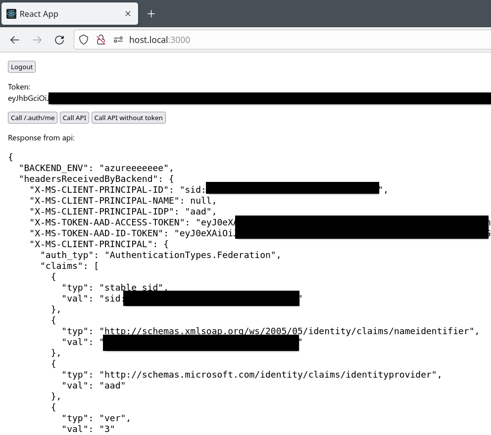
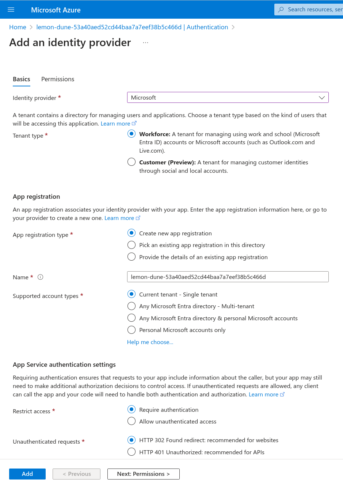
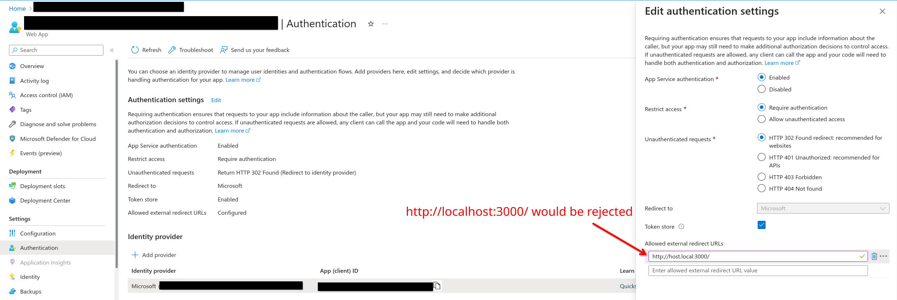

Demo: see ./aad-demo.mp4

**Updates not shown in video:**

- Backend now echos headers of interest.
- Frontend has an additional "Call /.auth/me" feature.



# The general principle

1. In Authentication settings, add allowed external redirect URL, say,
   `http://host.local:3000/aad-callback/` (localhost would be rejected)
2. In **/etc/hosts**, add `127.0.0.1 host.local`
3. Visit this link:

    ```
    https://your-site.azurewebsites.net/.auth/login/aad?post_login_redirect_uri=http%3A%2F%2Fhost.local%3A3000%2F
            ^-------^ your azure webapp              your external redirect url ^-------------------------------^
    ```

4. After a successful login, you will be redirect to
   http://host.local:3000/aad-callback/, which is FE.
   In FE, read the `#token={...}` fragment. [Here's the docs.][doc1]
   An example:

    ```json
    {
        "authenticationToken": "eyJhbGc...JKno",
        "user": { "userId": "sid:123...45678" }
    }
    ```

5. Stick this authenticationToken value into an `X-ZUMO-AUTH` header in all
   requests:
    ```
    GET https://<appname>.azurewebsites.net/api/hello/
    X-ZUMO-AUTH: <authenticationToken_value>
    ```

6. Of course, remember to allow your CORS:

    

Profit?


# How to reproduce this demo specifically

There are 2 services: ./backend/ to be deployed on AZ, while ./frontend/ to run
locally.

Before running anything, copy .env.sample to .env, enter your correct
`REACT_APP_BACKEND_URL`, then source those environment variables using your
favorite method (I like direnv personally).

Now you can try running both locally:

```sh
make be # http://localhost:8000/api/hello/
make fe # http://localhost:3000
```

Turn off be, then read on:

## 1. Deploy backend as an Azure webapp

```sh
# This installs `az` into your $PATH:
pipx install azure-cli

cd frontend && npm install && cd ..

# Uses az to create & deploy webapp;
# You'll get a ./backend/.azure/config file - keep it.
make init-be
```

Backend uses a `BACKEND_ENV` envar to identify itself.
Since `az webapp` doesn't allow configuring envars (or I haven't found it),
set it on azure portal:


Run `make deploy-be` to make sure the app restarts with the right envar I
guess.

Now go to http://your-app.azurewebsites.net/api/hello/ - you should see an
empty web page with the message `Greetings from $BACKEND_ENV.`

## 2. Authentication setup

Go to your app on azure portal, Authentication, Add Identity Provider.



Then Edit Authentication Setting, add `http://host.local:3000/` to "Allowed
external redirect URLs". Open your **/etc/hosts**, add `127.0.0.1 host.local`.



Now follow steps 3 to 6 in "The general principle" above.

[doc1]: https://learn.microsoft.com/en-us/azure/app-service/configure-authentication-customize-sign-in-out#use-multiple-sign-in-providers
