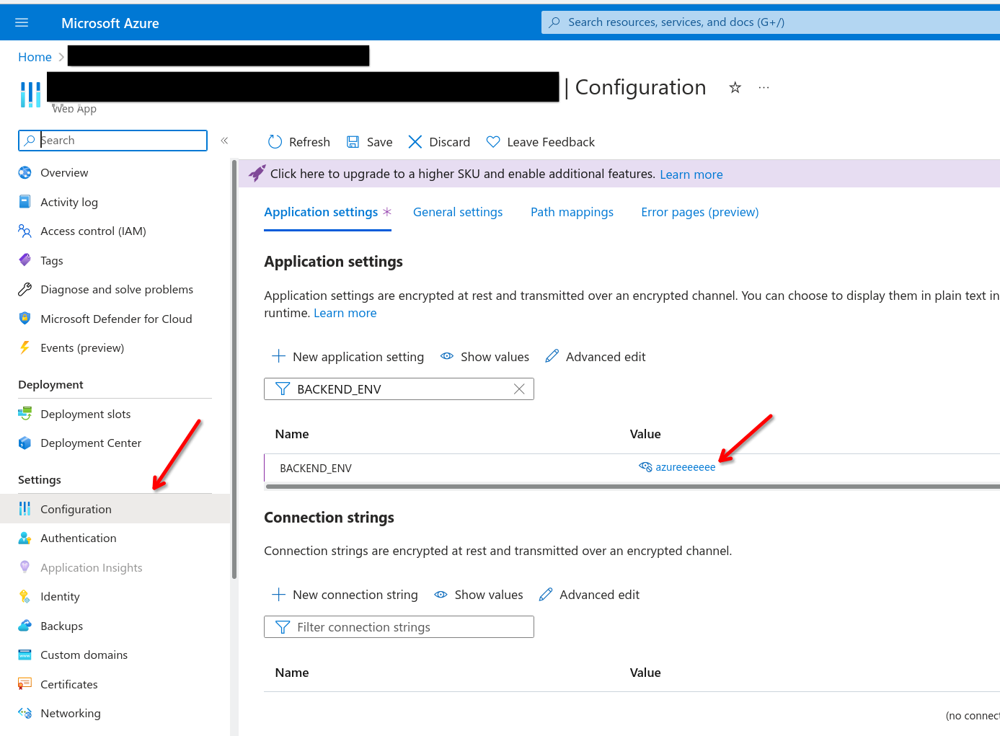

# 1. Deploy backend as an Azure webapp

```sh
pipx install azure-cli # then make sure `az` is available in $PATH
make be-deploy
```

Since `az webapp` doesn't allow configuring envars (or I haven't found it), do
it on azure portal:



Dev:

```sh
make be # http://localhost:8000
make fe # http://localhost:3000
```
